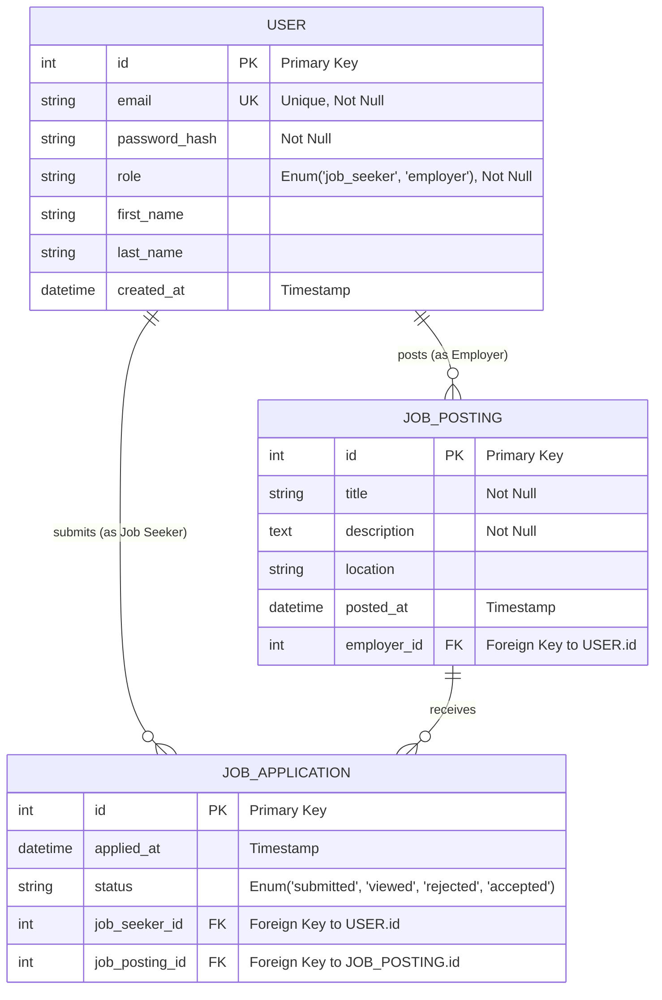

# RecruitConnect Database Schema

This document provides a detailed outline of the database schema for the RecruitConnect application. It is designed to serve as a comprehensive reference for developers, detailing table structures, column definitions, and their relationships.

## Entity-Relationship Diagram (ERD)

The following diagram visualizes the relationships between the core entities of the application.

---

## Table & Column Descriptions

### `USER` Table
Stores information for all users, who can be either a 'job_seeker' or an 'employer'.

| Column          | Type      | Constraints              | Description                                      |
|-----------------|-----------|--------------------------|--------------------------------------------------|
| `id`            | `integer` | **Primary Key**          | Unique identifier for the user.                  |
| `email`         | `string`  | **Unique**, **Not Null** | User's email address, used for login.            |
| `password_hash` | `string`  | **Not Null**             | Hashed password for the user.                    |
| `role`          | `enum`    | **Not Null**             | Defines the user's role ('job_seeker' or 'employer'). |
| `first_name`    | `string`  |                          | User's first name.                               |
| `last_name`     | `string`  |                          | User's last name.                                |
| `created_at`    | `datetime`| Default: `NOW()`         | Timestamp of when the user account was created.  |

### `JOB_POSTING` Table
Stores all job listings created by users with the 'employer' role.

| Column        | Type      | Constraints              | Description                                      |
|---------------|-----------|--------------------------|--------------------------------------------------|
| `id`          | `integer` | **Primary Key**          | Unique identifier for the job posting.           |
| `title`       | `string`  | **Not Null**             | The title of the job.                            |
| `description` | `text`    | **Not Null**             | A detailed description of the job.               |
| `location`    | `string`  |                          | The location of the job (e.g., "Remote", "City, State"). |
| `posted_at`   | `datetime`| Default: `NOW()`         | Timestamp of when the job was posted.            |
| `employer_id` | `integer` | **Foreign Key (USER.id)**| References the 'employer' user who created the post. |

### `JOB_APPLICATION` Table
Stores applications submitted by 'job_seeker' users for specific job postings.

| Column           | Type      | Constraints                          | Description                                      |
|------------------|-----------|--------------------------------------|--------------------------------------------------|
| `id`             | `integer` | **Primary Key**                      | Unique identifier for the job application.       |
| `applied_at`     | `datetime`| Default: `NOW()`                     | Timestamp of when the application was submitted. |
| `status`         | `enum`    | Default: `'submitted'`               | The current status of the application.           |
| `job_seeker_id`  | `integer` | **Foreign Key (USER.id)**            | References the 'job_seeker' user who applied.    |
| `job_posting_id` | `integer` | **Foreign Key (JOB_POSTING.id)**     | References the job posting being applied for.    |

---

## Relationship Definitions

### 1. User (Employer) to Job Postings
-   **Type**: One-to-Many (`1:N`)
-   **Description**: A single `USER` with the role 'employer' can create multiple `JOB_POSTING` records. Each `JOB_POSTING` is linked back to exactly one `USER`.
-   **Implementation**: The `JOB_POSTING` table has a foreign key column `employer_id` that references the `id` column in the `USER` table.

### 2. User (Job Seeker) to Job Applications
-   **Type**: One-to-Many (`1:N`)
-   **Description**: A single `USER` with the role 'job_seeker' can submit multiple `JOB_APPLICATION` records. Each `JOB_APPLICATION` is linked back to exactly one `USER`.
-   **Implementation**: The `JOB_APPLICATION` table has a foreign key column `job_seeker_id` that references the `id` column in the `USER` table.

### 3. Job Posting to Job Applications
-   **Type**: One-to-Many (`1:N`)
-   **Description**: A single `JOB_POSTING` can receive multiple `JOB_APPLICATION` records from different job seekers. Each `JOB_APPLICATION` is for exactly one `JOB_POSTING`.
-   **Implementation**: The `JOB_APPLICATION` table has a foreign key column `job_posting_id` that references the `id` column in the `JOB_POSTING` table.